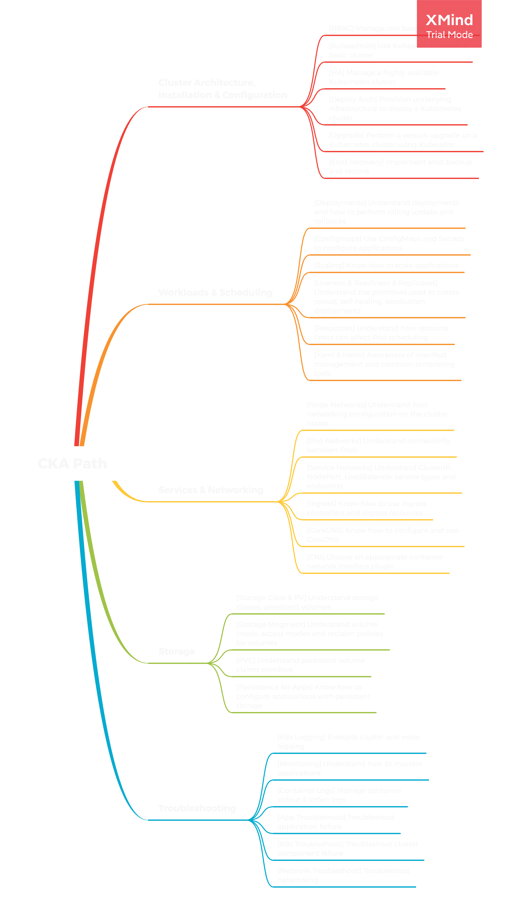

# Overall Path to CKA
[Back](..)
## Contents need to complete

### 25% - Cluster Architecture, Installation & Configuration
[ ] **RBAC:** Manage role based access control  
[ ] **KubeAdmin:** Use Kubeadm to install a basic cluster  
[ ] **HA:** Manage a highly-available Kubernetes cluster  
[ ] **Deploy Arch:** Provision underlying infrastructure to deploy a Kubernetes cluster  
[ ] **Upgrade:** Perform a version upgrade on a Kubernetes cluster using Kubeadm  
[ ] **Etcd Recovery:** Implement etcd backup and restore  
### 15% - Workloads & Scheduling  
[ ] **Deployments:** Understand deployments and how to perform rolling update and rollbacks  
[ ] **Configmaps:** Use ConfigMaps and Secrets to configure applications  
[ ] **Scaling:** Know how to scale applications  
[ ] **Replicaset & Liveness & Readiness :** Understand the primitives used to create robust, self-healing, application deployments   
[ ] **Resources:** Understand how resource limits can affect Pod scheduling  
[ ] **Yamls and Helm charts:** Awareness of manifest management and common templating tools  
### 20% - Services & Networking
[ ] **Node Networks:** Understand host networking configuration on the cluster nodes  
[ ] **Pod Networks:** Understand connectivity between Pods  
[ ] **Service Networks:** Understand ClusterIP, NodePort, LoadBalancer service types and endpoints  
[ ] **Ingress:** Know how to use Ingress controllers and Ingress resources  
[ ] **CoreDNS:** Know how to configure and use CoreDNS  
[ ] **CNI:** Choose an appropriate container network interface plugin  
### 10% - Storage
[ ] **Storage Class and PV:** Understand storage classes, persistent volumes  
[ ] **Strorage Mngment:** Understand volume mode, access modes and reclaim policies for volumes  
[ ] **PVC:** Understand persistent volume claims primitive  
[ ] **Persistence for Apps:** Know how to configure applications with persistent storage  
### 30% - Troubleshooting  
[ ] **K8s Logging:** Evaluate cluster and node logging  
[ ] **Monitoring:** Understand how to monitor applications  
[ ] **Container Logs:** Manage container stdout & stderr logs  
[ ] **App Troubleshoot:** Troubleshoot application failure  
[ ] **K8s Troubleshoot:** Troubleshoot cluster component failure  
[ ] **Network Troubleshoot:** Troubleshoot networking  

## References
1. [CNCF Curriculum](https://github.com/cncf/curriculum)
2. [Kubernetes](https://github.com/kubernetes/kubernetes)
3. [Kubernetes集群管理实践](https://www.bilibili.com/video/BV1qJ411k7ZL)
4. [Kubernetes教程(深入掌握k8s)](https://www.bilibili.com/video/BV1W5411t7Ep)
5. [Kubernetes CKA认证培训](https://www.bilibili.com/video/BV1S7411m7vM)

#### Plan
1. Init: arch init, plan init, resources list
2. Running: 0/5 of the path
3. Overall training, let's taste some chaos.
